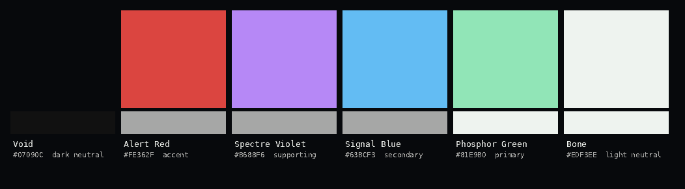

# A Setting for a Cyberpunk TTRPG Campaign — Assignment 5

A lore reference for the cyberpunk tabletop campaign I run, built to look like a
public access terminal in the city it describes.

This week the colour palette was rebuilt around value rather than hue, every
image was redrawn and optimised, the four duplicated page themes collapsed into
CSS variables, the factions page became a Grid, and the whole site got a
breakpoint for small screens.

**Live site:** `https://mason-alexander-shimek.github.io/Intro-to-Web-Desgn/Assignment5/`

---

## Component Plan

* **Webpage the component will be applied to:** `factions.html`
* **Type of component:** an image-and-content gallery — a grid of faction cards,
  one per organisation operating in or around Moscow.
* **Why it's needed:** the page had the same sixteen organisations on it twice.
  A flexbox gallery at the top showed each one's registry mark and name, and
  below it a bulleted list repeated all sixteen names with a paragraph each. A
  player looking something up had to scroll past the marks, find the name again
  in a wall of list items, and read. Merging the two into one card per faction
  removes the duplication, puts the mark next to the text that explains it, and
  turns sixteen stacked paragraphs into sixteen scannable chunks.
* **Features:** each card needs an image (the registry mark), a heading (the
  organisation's name) and a paragraph (its blurb). The container needs even
  spacing, equal column widths, and rows whose cards share a height so the grid
  reads as a grid instead of a ragged pile.
* **What you'll use to build it:** **Grid**. Flexbox arranges along one axis,
  and this component needs two: every column has to share a width *and* every
  card in a row has to share a height. `grid-template-columns: repeat(auto-fit,
  minmax(190px, 1fr))` also drops the column count from three to two to one as
  the screen narrows, so the component stays responsive without the media query
  having to touch it.

**Built.** It is `#registry` on `factions.html`, with `.faction` for each card.

---

## Visual Appeal

### The palette



| Swatch | Role | Hex | Lightness (L\*) |
| --- | --- | --- | --- |
| Void | dark neutral | `#07090C` | 2 |
| Alert Red | accent | `#FE362F` | 56 |
| Spectre Violet | supporting | `#B688F6` | 65 |
| Signal Blue | secondary | `#63BCF3` | 73 |
| Phosphor Green | primary | `#81E9B0` | 85 |
| Bone | light neutral | `#EDF3EE` | 95 |

**What was wrong with the old one.** The site has always had four coloured
pages, but the four colours sat within 19 L\* of each other. In the greyscale
strip under the swatches above, that meant four nearly identical greys. Anyone
who can't distinguish hues was getting no information from the colour coding at
all, which is the exact problem the lesson raises.

**What changed.** The four featured hues were respaced to 29 L\* apart, and the
neutrals pushed further to each end, giving a 93 L\* range across the palette.
The greyscale strip is now a readable staircase. Red could not go darker without
its links dropping under 4.5:1 on a dark background, so the extra range came
from lifting green rather than dropping red.

**How it is applied.** Each page sets the same six role variables to a different
swatch, so the whole screen retints from one class on the `<body>` tag:

```css
.page-city {
  --hue:    #63BCF3;   /* Signal Blue */
  --screen: #0B1116;
  --panel:  #121E27;
  --rule:   #26465B;
  --muted:  #58829C;
  --body:   #B9DEF0;
}
```

The screen, panel, rule, muted and body values are not separate colours. Each is
a blend of Void, that page's swatch, and Bone, so the whole site is six colours
and the blends between them.

### Images

Everything in `images/` was redrawn in the new palette and re-encoded. Each file
was saved several ways and the smallest was kept: an indexed PNG with a
transparency ramp for the one-colour glyphs, a quantised palette for the flat
artwork, and plain RGBA where the palette overhead cost more than it saved — on
a 16×16 bullet, a 48-entry palette is bigger than the pixels it describes.

| | Assignment 4 | Assignment 5 |
| --- | --- | --- |
| Total weight of `images/` | 638 KB | **97 KB** (85% smaller) |
| Largest single file | 236 KB | **44 KB** |
| Number of files | 33 | 41 |

New this week: eight district glyphs for the subsector table, and the palette
swatch sheet above. The untouched original of the world map moved out of
`images/` into `source/`, so the folder the browser downloads from holds only
web-ready files.

---

## Structure & Organization

### Flexbox and Grid

Both are in use, each where it fits:

| Where | System | Why |
| --- | --- | --- |
| `nav ul` | Flexbox | Four links along one axis that wrap when the screen is narrow. |
| `#registry` | Grid | Sixteen cards needing shared column widths *and* shared row heights. |
| `#icon-set` | Flexbox | Uniform tiles that only need to wrap and centre. |
| `#palette-strip` | Flexbox | Six swatches sharing one row evenly. |

### The stylesheet

The four page themes used to be four near-identical blocks of about 110 rules
each, which meant changing one colour meant finding it in four places. They are
now four blocks of six variable declarations. The stylesheet went from 942 lines
to 727 while gaining two new components, and it declares 14 variables that are
read 66 times.

This also fixed a bug from Assignment 3. The card variants used to lose a
specificity race against the page theme, so they only worked because they sat
last in the file. Custom properties are inherited rather than matched, so a card
that sets its own `--hue` now wins wherever it sits.

### Media query

At the bottom of the stylesheet, as the lesson suggests:

```css
@media (max-width: 600px) { ... }
```

Tested at 600px, 480px and 375px. What it changes, and why each one needed it:

* **Hero headline** from 46px to 30px. At 46px, "A SETTING FOR A CYBERPUNK TTRPG
  CAMPAIGN" took three lines and the whole first screen.
* **Nav padding and font size** down just far enough that four links still fit
  on one row. Without it the nav wrapped to two rows and, because it is sticky,
  permanently covered 79px of a phone screen. It now covers 32px and still
  sticks, which is where a sticky nav is most useful.
* **Cards** from `max-width: 24%` to full width, so they stop sitting in a
  190px column with empty space beside them.
* **Table** type and padding down, and the district glyph hidden. Three columns
  of monospace in 375px was giving two words a line.
* **Body, hero, form and drop cap** padding reduced.

The registry grid is deliberately **not** in the media query. `auto-fit` already
drops it from three columns to two to one on its own, and adding a rule for it
would be duplicating work the layout already does.

---

## Accessibility

Every text and background pair was checked against its own page's screen:

| Page | Body text | Featured hue | Muted text |
| --- | --- | --- | --- |
| Home | 14.9:1 | 12.7:1 | 4.6:1 |
| City | 13.4:1 | 9.1:1 | 4.6:1 |
| Orihia | 10.4:1 | 5.4:1 | 4.6:1 |
| Factions | 12.4:1 | 7.1:1 | 4.6:1 |

WCAG AA asks for 4.5:1. The muted values are not hand-picked — each is solved by
dimming that page's hue toward the screen as far as it can go while still
clearing 4.6:1.

Colour is never the only signal. The current nav tab is inverted as well as
coloured, links are underlined as well as lit, every heading carries an icon,
and the greyscale staircase means the page colours differ by value too.

---

## Reflection

**What did you create or organize this week that you think will be most useful
in future websites? Why?**

The palette as CSS variables. Before this week, a colour lived in the stylesheet
wherever it happened to be needed, which meant four page themes repeated the
same structure with different hex values and roughly 450 lines said almost the
same thing four times. Now there are six swatches at the top of the file and
every rule reads from them. Changing the site's entire colour scheme is editing
six lines.

What makes it useful beyond this project is that it separates two things I had
been treating as one: what a colour *is* and what a colour is *for*. `--hue` is
a role, and each page fills that role with a different swatch. Any future site
can reuse the same structure with a completely different palette, which is why
the ComponentLibrary folder holds the stylesheet rather than just the markup.

**How did working with reusable components affect the way you approached your
design this week?**

It changed what I noticed. Because the components were already separated out and
named, the duplication on the factions page became obvious in a way it hadn't
been while I was writing it — a gallery and a list that were both, structurally,
sixteen things with a name and an image. Seeing them as two components instead
of two sections is what made it clear they should be one.

It also changed the order I worked in. I built the registry grid in
`components.html` first, with three cards, got it right there, and only then
generated the other thirteen. Previously I would have edited the real page and
reloaded it sixteen cards at a time. Testing one card is faster and the mistakes
are cheaper.

The honest downside is that components make it tempting to use one where it
doesn't fit. I first built the Grid for the city page's eight subsectors and it
was clearly worse than what it replaced — those entries average 102 words, and
in a 210px column that produced cards 900px tall. The faction entries average
46, which is card-sized. The component wasn't wrong, the content was. I moved it
and left the city page's long prose as prose.

---

## File structure

```
Assignment5
├── index.html          hero, drop cap, card group, history, lore request form
├── city.html           subsector quick-reference table, then the full entries
├── orihia.html         the corporation
├── factions.html       the registry Grid — 16 faction cards
├── components.html     the component library
├── images/             41 web-ready PNGs
├── screenshots/        progress screenshots, and the two game screenshots
├── source/             the untouched original of the world map
├── styles/
│   └── styles.css      palette, themes, components, media query
├── media/              audio and video assets
└── README.md
```

## Screenshots

`screenshots/progress-screenshot.png` shows the new registry Grid on
`factions.html` at desktop width, and `progress-screenshot-mobile.png` shows the
same component at 390px where `auto-fit` has dropped it to a single column.

The Flexbox Froggy and Grid Garden screenshots go in the same folder.

## Known limitations

* **The form still doesn't send anything.** GitHub Pages serves static files, so
  there is no server to receive a submission, and it has no `action` attribute
  on purpose.
* **`main img` sets `display: block`**, which is right for the world map and
  wrong for an icon inside a heading or a table cell. `main h2 img` and `td img`
  both have to set `display: inline` to escape it.
* **The homepage cards still use `inline-block`**, so three cards of uneven
  height sit on their tops rather than filling the row. Grid would fix it. It is
  the obvious candidate for next week.
